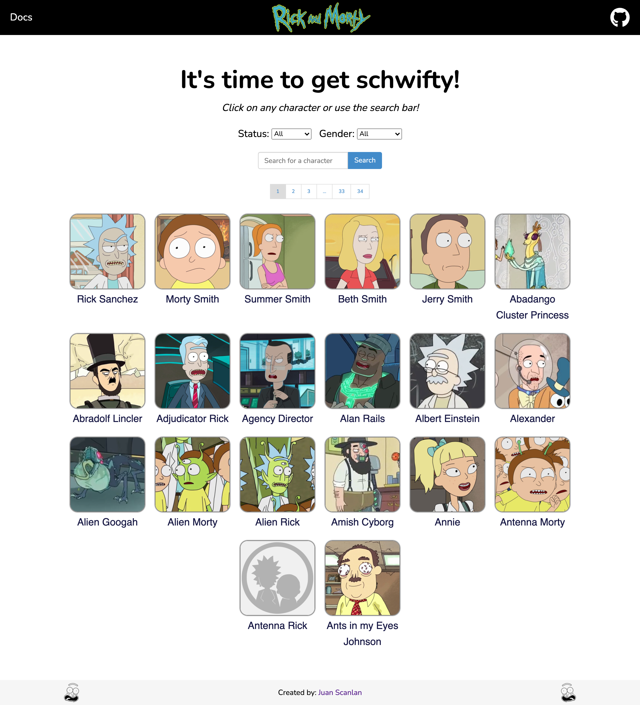
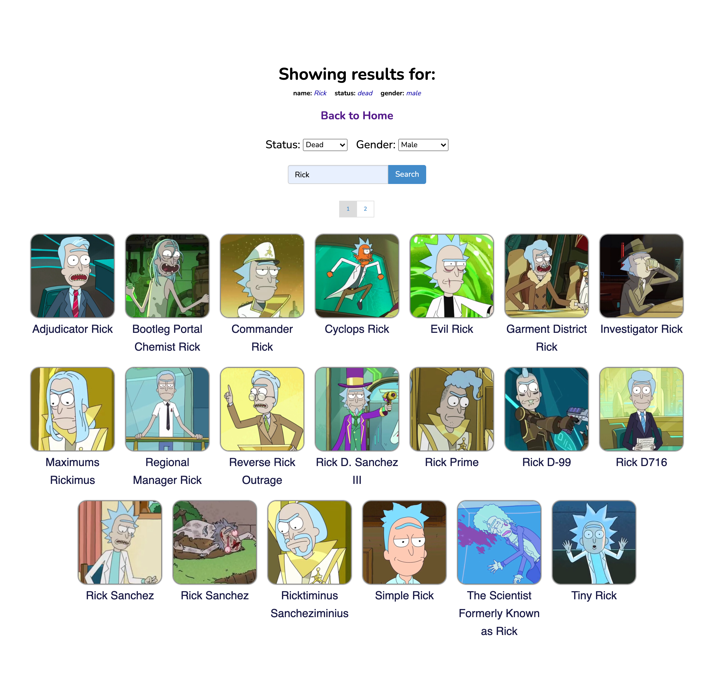
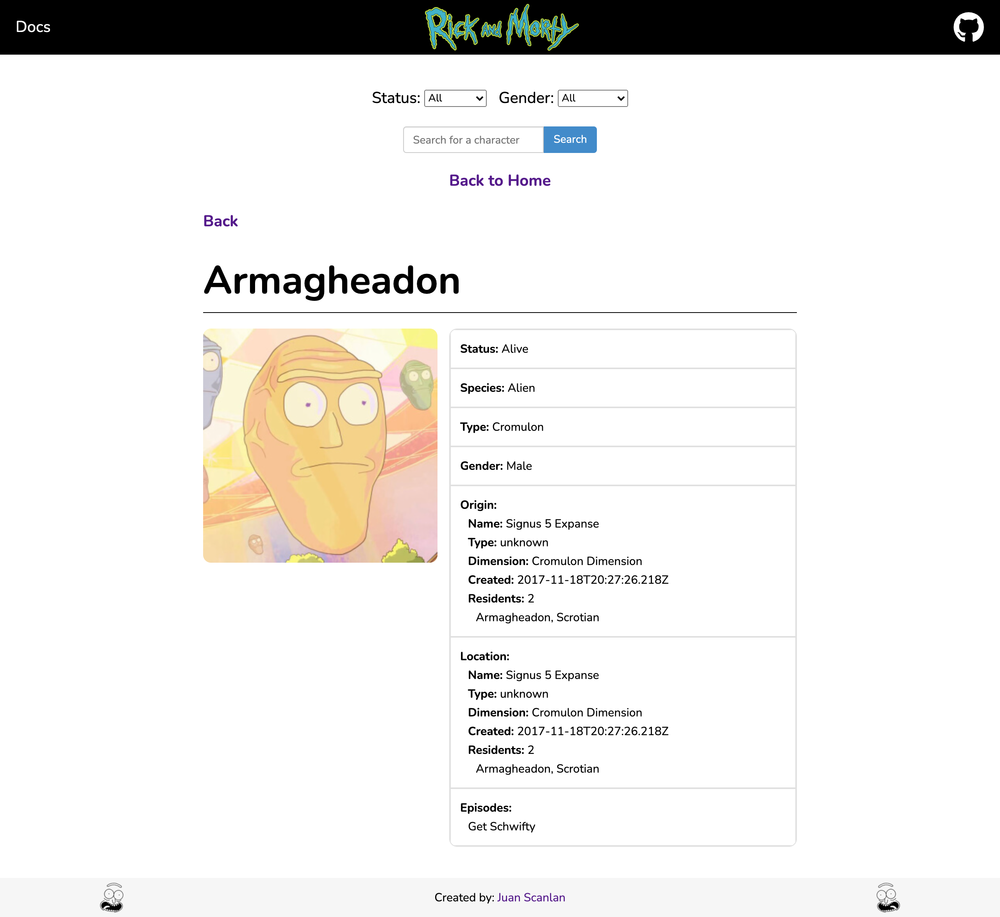
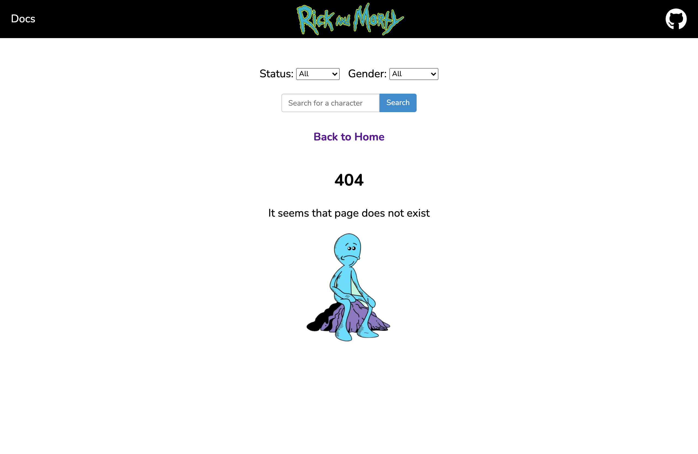

 

#  Rick and Morty API 

🖥️ Live site: https://juanscanlan.github.io/RickAndMortyAPI/#/
This project was developed in React.js

## Installing dependencies

In the project directory, you can run:

### `npm install`

Downloads all required packages.

### `npm start`

Runs the app in the development mode.\
Open [http://localhost:3000](http://localhost:3000) to view it in the browser.

The page will reload if you make edits.\
You will also see any lint errors in the console.

## Technologies used:
* React.js:
    * Hooks: useState, useEffect.
    * React Router: 
        * useHistory, useParams.
        * BrowserRouter, Route, Switch, Redirect.
* SCSS.
* Font Awesome Icons.

## Improvements given more time:

* Use Typescript for TypeError checking.
* Create reusable SASS mixins.
* Run unit tests on components using Jest and React Testing Library:
    * Error testing for all API fetch requests.
    * The logic for the Pagination.js component.
    * React routing for dynamic urls.
    * All possible queries for SearchBar.js component.
    * Rendering of data from API.
* Possibly implementing a database to store the data and check for frequent updates; instead of always fetching the data. 

## Page Previews: (Ctrl/Cmd + Click to open in new tab)
### Home Page

### Search Page

### Character Profile Page

### Invalid url Page

